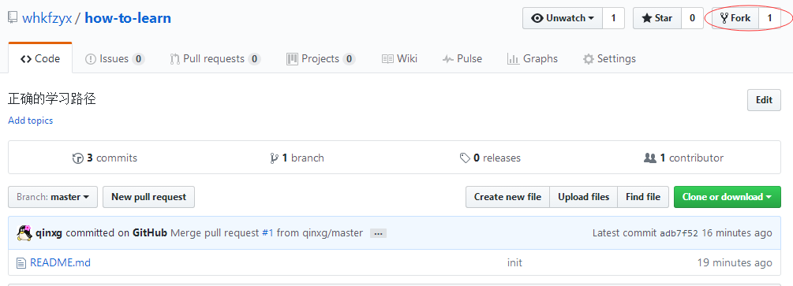
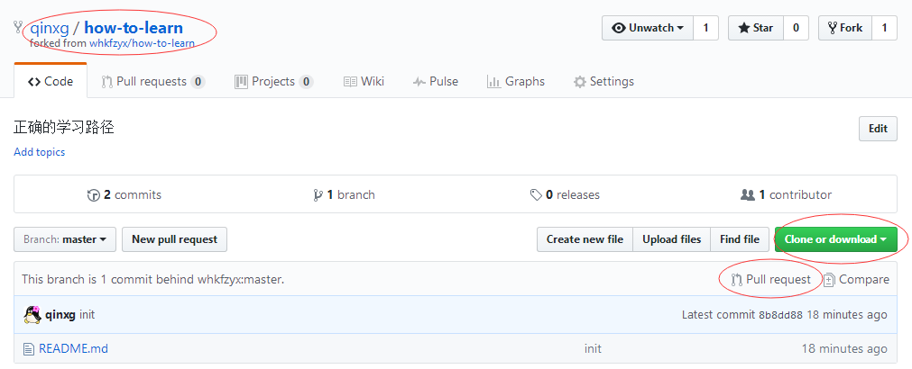

# how-to-learn
> 移动WebApp开发学习曲线

## 开发资料

### 入门

* **[html]** - html是一种用于创建网页的标准标记语言，在本教程中，你将学习如何使用html来创建网页。

* **[html5]** - html5是新一代的html，本教程向您讲解 html5 中的新特性。

* **[css]** - css用于控制网页的样式和布局，在本教程中，您会学到如何使用css控制多种网页的样式和布局。

* **[css3]** - css3是最新的css标准，本教程向您讲解 css3 中的新特性。

* **[javascript]** - javascript是属于网络的脚本语言，本教程将详细讲解javascript的标准语法和应用。

* **[vue框架]** - vue聚焦视图层，是一个构建数据驱动的Web界面的库，本教程出自官方文档，将循序渐进的带你学会vue。

### 实战

* **[router]** - vue官方维护的一套配合vue.js的路由插件。

* **[axios]** - axios是一个基于promise的HTTP库，可以工作于浏览器中，也可以在node.js中使用，提供了一个API用来处理XMLHttpRequests和node的http接口。

* **[vuex]** - vue官方维护的一套控制vue数据流的插件。

* **[调试]** - chrome开发工具就是一个工具，它允许Web开发人员可以通过浏览器应用程序干预和操作Web页面，也可以通过这个工具调试和测试Web页面或Web应用程序。

* **[VUX]** - 基于vue框架和微信WeUI样式库的一套第三方vue组件库，可以满足大多数基本的应用场景。

#### 高级

* **[ES6]** - ECMAScript 6.0（简称 es6）是 javascript 语言的下一代标准，已经在2015年6月正式发布了。

## 内部课程

### 入门

* **[vue基础入门]** - 介绍vue基础语法，通过课后作业，您将完成整个基础知识练习。

* **[vue组件入门]** - 介绍vue组件的基本创建方式以及组件间的数据传递方式，通过课后作业，可以对组件的应用有一个最基本的掌握和认识。

### 基础应用

* **[vue组件应用实践（上）]**  **[vue组件应用实践（下）]** - 介绍实际项目应用中的项目构建方式，以及在模块化开发中的vue单文件组件格式，并通过对 **[典型UI]** 页面的代码剖析来讲解 **[VUX]** 组件库的应用方式，通过本次课后作业，您可以基本掌握实际项目的一个完整流程，并了解单文件组件的用法。

## 能力评测

>能力评测为一个小工具帮你评估开发一个APP前需要掌握的技能，通过学习对于的级别资料。相信很快就能上手拉~

### 能开发简单的APP
* 掌握html(5)、javascript基础语法。
* 掌握css：
    * 基础语法
    * 选择器
    * css定位
    * [盒子模型]
* 掌握基本开发流程：nodejs、npm环境搭建&运行、[明源项目脚手架]使用
* 掌握 [vue框架] 所有知识点
* [实践]可完成简单html页面开发

### 能开发常见APP
* 进行前后台请求并熟悉跨域相关配置
* 能熟悉调用本地API
* 可以进行简单调试、错误定位
* 独立完成一般组件开发
* [实践]进行复杂页面布局(掌握[flex]布局)

### 开发出性能、交互较高的APP
* 掌握并能说明es6特性
* 在社群基础上进行组件扩展
* 评估、引入第三方开源类库
* 案例解析与典型功能沉淀

## 其他补充

暂无

## 如何参与贡献？

### 我有问题

你可以在 **[issues]** 登记问题，我们会第一时间处理。

### 我有心得
我们认为分享是一种更好的检测学习方式。

学习过程中产生的心得以及认为比较好的资料，你可以按照下面流程进行提交：

* 点击右上角fork本文档
* 在自己的repositories中clone到本地并修改
* 检查修改内容是否正确，同步到服务器
* 点击 Pull Request 提交修改到**whkfzyx**主干
* **whkfzyx**审核修改，接受Pull

(fork文档)

（修改与提交文档）

### 查看贡献

谁贡献最多？ 戳->  [项目贡献] 

<!-- References -->

[html]: http://www.w3school.com.cn/html/index.asp
[html5]: http://www.w3school.com.cn/html5/index.asp
[css]: http://www.w3school.com.cn/css/index.asp
[css3]: http://www.w3school.com.cn/css3/index.asp
[javascript]: http://www.w3school.com.cn/b.asp
[vue框架]: https://cn.vuejs.org/v2/guide/

[盒子模型]: http://www.w3school.com.cn/css/css_boxmodel.asp

[router]: https://router.vuejs.org/zh-cn/
[axios]: https://github.com/mzabriskie/axios
[vuex]: https://vuex.vuejs.org/zh-cn/getting-started.html
[调试]: http://www.w3cplus.com/tools/how-to-use-chrome-devtools-like-a-pro.html
[VUX]: https://vux.li/#/zh-CN/README

[flex]: http://www.ruanyifeng.com/blog/2015/07/flex-grammar.html

[ES6]: http://es6.ruanyifeng.com/

[vue基础入门]: https://github.com/whkfzyx/how-to-learn/tree/master/lesson/1.vue基础入门
[vue组件入门]: https://github.com/whkfzyx/how-to-learn/tree/master/lesson/2.vue组件入门
[vue组件应用实践（上）]: ./lesson/3.vue组件应用之基础篇
[vue组件应用实践（下）]: ./lesson/4.vue组件应用之实操篇
[典型UI]: https://github.com/whkfzyx/vue2.x-mysoft-standardui

[项目贡献]:https://github.com/whkfzyx/how-to-learn/graphs/contributors

[issues]:https://github.com/whkfzyx/how-to-learn/issues

[明源项目脚手架]:https://github.com/whkfzyx/cli
